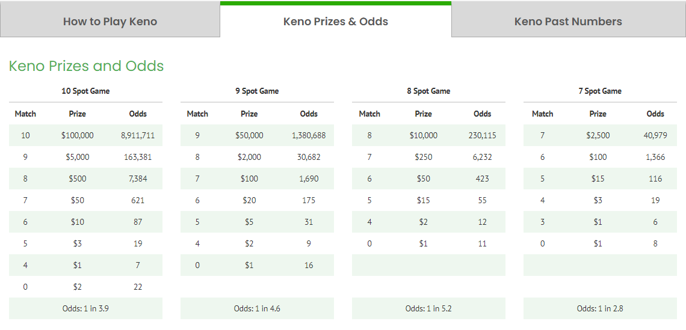

# Keno

Our Keno simulation is modeled on the game provided by the Virginia State Lottery. [Keno](https://www.valottery.com/data/draw-games/keno). 

## The Game

In the Virginia version of the game, players pick from 1 to 10 numbers or "spots" (from the population range of 1 to 80). The Lottery then randomly picks 20 numbers from the same 1 to 80 range and players win predetermined amounts based on the number of matches they have. Virginia Lottery have a good explanation in a [2-minute marketing video](https://www.youtube.com/watch?v=LNPsMmxjQDc). 

### Simulating a Game in R

Assuming the game is unbiased, we can simulate a single game quite easily. Let's play the 10-Spot game, one-time, waging \$1. Below we pick 10 numbers (spots = 10) from the population range in `pick` and then simulate a single game's drawing of 20 numbers in `draw`. 

```{r, message=F, warning=F}

spots <- 10 # the number of spots in our simulated game
keno_range <- 1:80
set.seed(11) # so that random outcomes can be reproduced

pick <- sample(keno_range, spots)
sort(pick) # sorted for viewing convenience

draw <- sample(keno_range, 20)
sort(draw)
```

Apparently, we have five matches in this particular game which sounds pretty promising as half of our 10 spots were selected. Below we fetch them from the two objects `pick` and `draw` that we created above.

```{r}
sort(draw[draw %in% pick]) # subset from draw when the number is found in pick
```

Now we need to look-up the associated Prize for our five matches from a 10-Spot game as per the published table in the Odds table of Virginia Lottery's [Keno page](https://www.valottery.com/data/draw-games/keno).
  


Which turns out to be a Prize of \$3, or \$2 net of our ticket cost. We have won 2x our wager which is a nice return. 

Do note however, that the odds of such an outcome in the table above is 19 (read as 1 in 19) or a 5.26% probability. At first glance, this may seem a  disproportionately small payoff for the odds of getting 5 spots correct, and that would be correct if the player had to specify the match level they were playing. But because there is a payoff (in the 10-Spot game) for all matches except 1, 2 or 3 matches there is a higher probability of getting a match at some level so the payoff to odds ratio is better. And below we'll show how much better. 


## The `play_keno` Function

Now that the basics of the game are understood, let's wrap that single game into a function for reuse in our simulation. Note that the manual prize lookup has been automated via a manually created `prize_table`. The output of the function is a small table with a single row and the games parameters. 

```{r}

play_keno <- function(spots, keno_range = 1:80, draw_size = 20, wager = 1) {
  
  pick <- sample(keno_range, spots) # same as above
  draw <- sample(keno_range, draw_size) # same as above

  
  matches <- sum(pick %in% draw) # we don't care whichs number match, just the total
  
  prize <- prize_table %>%
    select(Match, contains(as.character(spots))) %>% # isolate column for the game we are playing
    filter(Match == matches) %>% #isolate the matches we made
    pull(2) # isolate just the numeric from the dataframe
  
  tmp <- tibble(Spots = spots,
                Wager = wager,
                Matches = matches,
                Prize = prize * wager ) %>%
    mutate(Net = Prize - Wager,
           Result = factor(ifelse(Prize == 0, "Lose", "Win"))) # color mapping for our charts
  
  return(tmp)
}

prize_table <- read_xlsx("./input/keno prizes.xlsx") # load our prize table
set.seed(11) # to creat the same random outputs as above
gt(play_keno(10)) # play a 10-Spot game, show in nice table with gt()

```

Interpreting the table above, we played the 10 spot game for a wager of $1 and got 5 matches equating to a \$3 prize (\$2 net of wager).

The official Virginia game allows for wagers of \$1 to \$10 which multiplies the prize by the wagered amount. So if we had made a \$5 wager above, our prize would have been \$15 (\$3 * 5). For simplicity and consistency, we are only going to consider wagers of $1 in our simulations as the probabilities hold, given the linear relationship of the prize to the wager.   

## Play 100,000 Games of Keno

In [Our R Environment] we set the number of simulations (`sims`) to 100,000. 

Next we set our number of simulations to 100,00 and `play_keno()` for each sim. 100K sims 

```{r}

plays <- 1:sims %>% # play a game for each sim
  map_dfr(function(x) play_keno(spots)) %>% # play a 10-Spot game with our function play_keno()
  mutate(Sim = 1:sims, # sim ID's
         Cumulative = cumsum(Net)) %>% # calc cumulative sum
  relocate(Sim) # move Sim to the first column

gt(plays %>%
  summarise(Sims = n(),
            Wager = sum(Wager),
            Prize = sum(Prize),
            Net = sum(Net), .groups = "drop") %>%
    mutate(Prob = round(Sims / sims, 3),
            EV = Prize / Sims * Prob) ) %>%
    tab_header(
    title = "Summary Results of 100K Simulated Games",
    subtitle = "Subtitle"
  ) 
  

```

For `r round(nrow(plays)/1e3, 0)`K simulations, we wagered \$`r round(sum(plays$Wager)/ 1e3, 0)`K and lost \$`r round(-sum(plays$Net)/ 1e3, 2)`K of it. Put another way, our expected value (EV) for the 10-Spot game is \$`r round( sum(plays$Prize) / sum(plays$Wager), 2)`


```{r}
summary <- plays %>%
  group_by(Matches) %>%
  summarise(Sims = n(),
            Wager = sum(Wager),
            Prize = sum(Prize),
            Net = sum(Net), .groups = "drop") %>%
  mutate(Prob = round(Sims / sims, 3),
         EV = Prize / Sims * Prob,
         Odds = round(1/EV, 0))

summary # results of our sims
```

Despite the best match level's expected value being only `r round(max(summary$EV) * 100, 1)` (above), our expected value for each game is `r round(sum(plays$EV) * 100, 0)` cents. This dynamic is due to the fact that players do not need to specify a match level beforehand. Thus, they participate in the payout at any winning level and their combined EV is the sum of all EV's. 

*Note:* The simulated probability of getting 5 matches in the 10-Spot game is 5.2% - which is consistent with the stated odds (1/19) for five matches. This illustrates an value attribute of simulations - despite not knowing the formula that the Lottery used for their odds, we have been able to validate them as being acceptably accurate.


## Net Position After 30 Games

With an EV of  `r round(sum(plays$EV), 2)` cents. we would expect to have \$`r round(sum(plays$EV) * 30 , 2)` in our pocket after wagering \$30 across 30 games. But no one plays Keno for the expected value, it is the big prizes that attracts players. So let's play 30 games, 1,000 times, and see what our ending balances are after this defined gameset.

```{r}

games <- 30
sims2 <- 1000

plays2 <- tibble()

for (i in 1:sims2) {
  
  games_batch <- 1:30 %>% # for each sim
    map_dfr(function(x) play_keno(spots)) %>%
    summarise(Net = sum(Net)) %>%
    mutate(Sim = i) %>% # calc cumulative sum
    relocate(Sim)
    
   plays2 <- plays2 %>%
     bind_rows(games_batch) %>%
     mutate(Color = factor(case_when(
       Net <= 0 ~ "-$30 - $0 Loss",
       Net > 0 & Net <= 30 ~ "$1-$30 Gain",
       Net > 30 & Net <= 60 ~ "$31-$60 Gain",
       Net > 60 & Net <= 90 ~ "$61-$90 Gain",
       TRUE ~ ">$90 Gain" )))
  
}

ggplot(plays2, aes(Sim, Net, color = Color)) +
  geom_jitter(alpha = 0.3) +
  geom_hline(yintercept = mean(plays2$Net))

summ_plays2 <- plays2 %>%
  group_by(Color) %>%
  summarise(Count = n(),
            Mean = mean(Net))


ggplot(plays2, aes(Net)) +
  geom_histogram(binwidth = 30) 

```

## Strategy Testing

Some possible strategies and their effectiveness against the baseline above (??)

## Conclusion

### Reconciling to Original (Manual in a Restaurant) Analysis

I realize now that my original calculation did not appreciate the sum of the EV's as being relevant (because players participate at all match levels in each game, rather then pre-specifying a match level). So my original EV was considerably understated. 

From this, we can draw some important lessons.

1. Don't do probability after a couple of beers at lunch.
2. Even when system probabilities are thought to be understood, a simulation will either prove it out or provide a better understanding. 

This has been a fun excercise, I hope you enjoyed it and learned a little bit about deriving probabilities when direct mathematical calculation is impractical.
